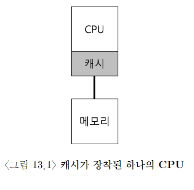
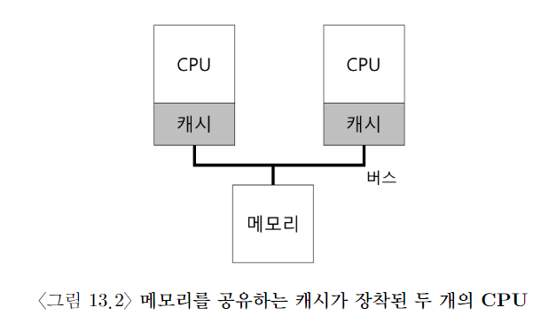

# 멀티 프로세서 스케줄링

- 다중 CPU 시대가 오면서, 그 성능을 최대한 활용하기 위해 application은 thread를 이용하기 시작.

- 그럼 멀티 프로세서 스케줄링은 어캐 해야 될까??

# 멀티 프로세서 구조

- temporal locality: 데이터가 한 번 접근되면, 근미래에 다시 접근되기 쉽다.

- spatial locality: 프로그램이 X의 데이터를 접근하면, X 주변의 데이터가 접근되기 쉽다.

- 근데 멀티 프로세서에서는 캐시가 두 개여서 cache coherence 문제가 발생...! 어떻게 해결할까?!?!!!

# 문제점1: 동기화(synchronization)

- 예를 들어 여러 CPU가 공유하는 Queue있다고 가정

- lock, unlock 없이는 제대로 작동하지 않을 것이다.

- 그러면 자료 구조 접근하는 연산은 매우 느려질 것이다. (그럴 거면 multi core 왜함?)

# 문제점2: cache affinity

- 한 프로세스는 가능한 한 동일 CPU에서 실행되려고 해야 된다.

- 왜냐? 딴 CPU로 옮겨 가면 다시 cache에 필요한 정보를 다시 탑재해야 되기 때문~

# 해결책: SQMS

- 장점: 하나의 큐밖에 없어 구현이 간단하다.

- 단점: 동기화 오버헤드 때문에 확장성이 나쁘고, 캐시 어피니티 문제가 있음.

# 해결책: MQMS

- 장점: 락과 cache contention이 더 이상 문제가 되지 않는다. 캐시 affinity도 좋음.

- 단점: 워크로드 불균형 -> migration
